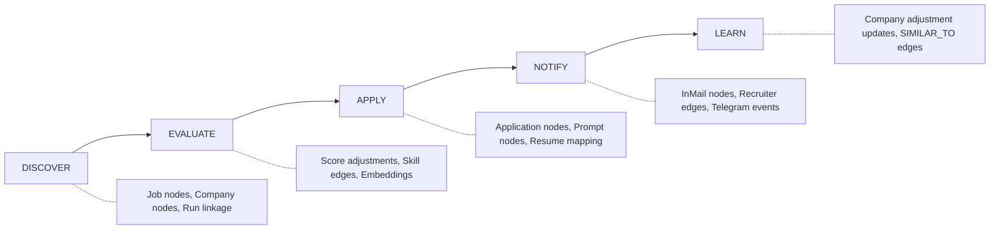
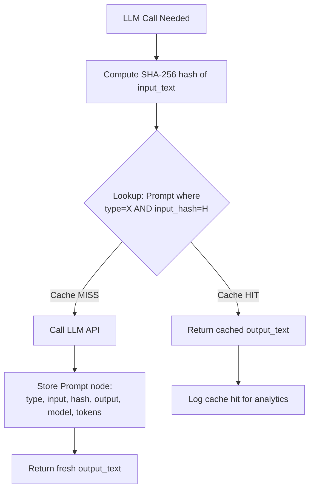
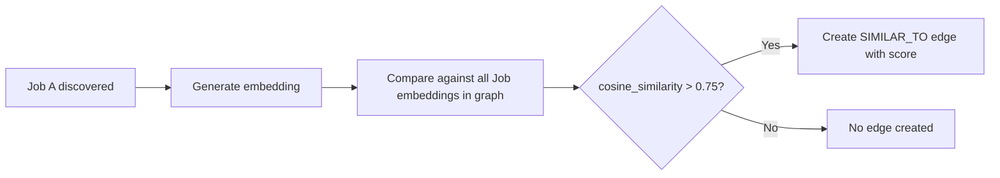
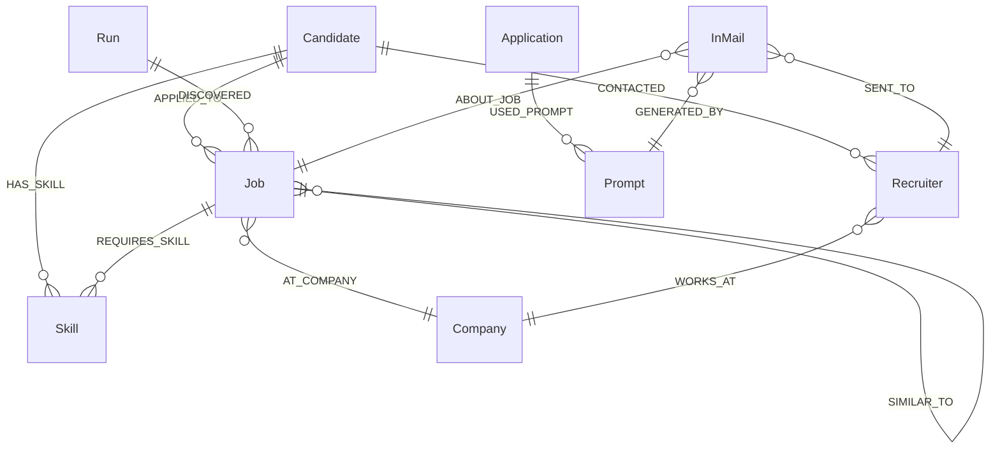
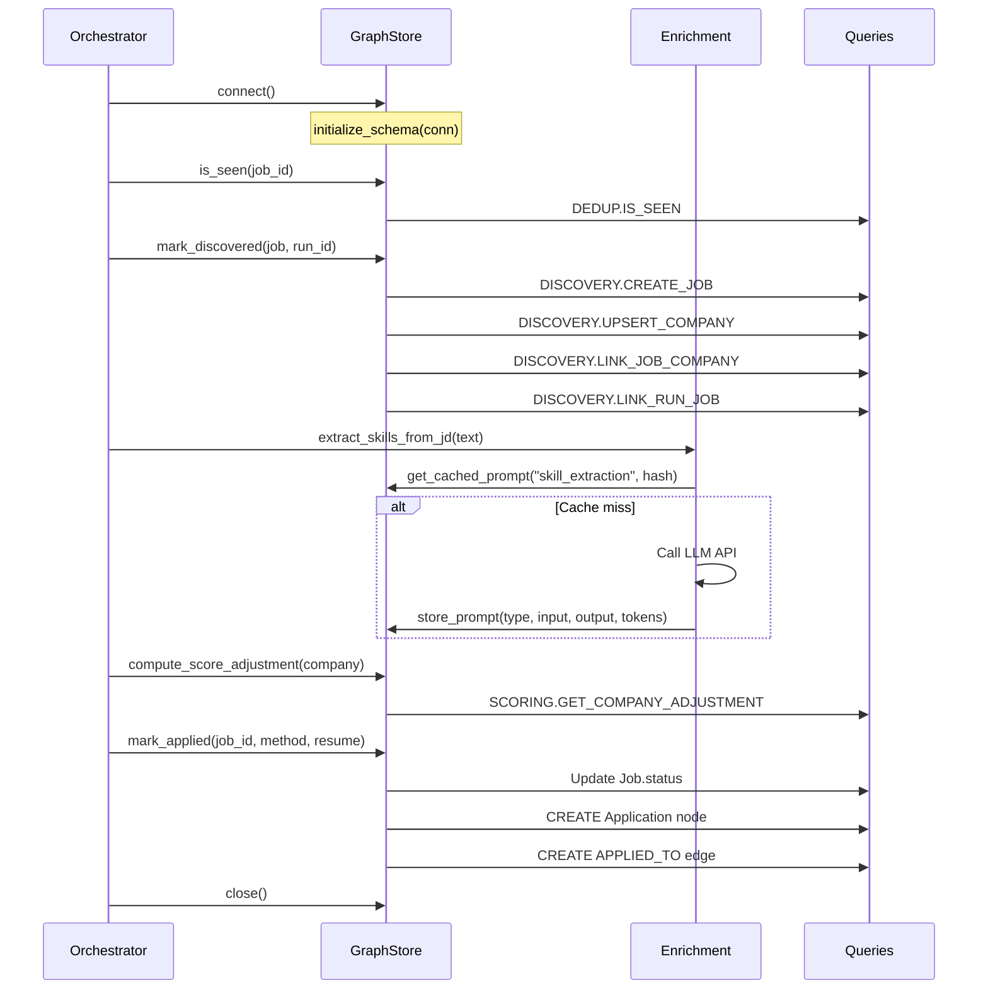

# ApplyPilot — Application Context Graph Specification

> **Module**: `linkedin_agent.graph`  
> **Database**: KùzuDB (embedded graph)  
> **Schema Version**: 1  
> **Last Updated**: 2026-08-04

---

## Table of Contents

1. [Overview & Purpose](#1-overview--purpose)
2. [Full Application Context Model](#2-full-application-context-model)
3. [Prompt Storage Design](#3-prompt-storage-design)
4. [Embedding & Similarity Design](#4-embedding--similarity-design)
5. [Complete Schema Reference](#5-complete-schema-reference)
6. [Pipeline Integration Map](#6-pipeline-integration-map)
7. [For AI Coding Assistants (Cursor, Claude, Copilot, Kiro)](#7-for-ai-coding-assistants-cursor-claude-copilot-kiro)
8. [Query Catalog](#8-query-catalog)
9. [Configuration](#9-configuration)
10. [Migration & Rollback](#10-migration--rollback)

---

## 1. Overview & Purpose

### What the Graph Stores

The Application Context Graph is an embedded knowledge graph (KùzuDB) that captures **every relationship** the ApplyPilot pipeline produces:

- **Jobs** — metadata, scores, descriptions, embeddings, lifecycle status
- **Companies** — identity, target/blocklist flags, historical score adjustments
- **Skills** — extracted from JDs and candidate profile, linked to jobs
- **Recruiters** — contacts, company affiliations, communication history
- **Applications** — method, resume used, timestamp, outcome
- **Runs** — agent execution records linking to discovered jobs
- **InMails** — drafts, recipients, associated jobs
- **Prompts** — every LLM call (input, output, model, tokens, hash for caching)

### From Stateless to Intelligent

Without the graph, ApplyPilot was **stateless between runs**:

| Before (Stateless) | After (Graph-Powered) |
|---------------------|-----------------------|
| SQLite dedup table (job_id → seen) | Rich job nodes with full metadata + relationships |
| No company memory | Company context: past jobs, recruiters, adjustments |
| LLM called fresh every time | Prompt caching via input hash → 60-80% token savings |
| No skill tracking | Extracted skills linked to jobs → gap analysis |
| No similarity awareness | Embedding-based "jobs like this one" recommendations |
| InMail drafts lost after send | Full InMail audit trail with recruiter history |
| No run correlation | Run nodes linking which jobs were discovered when |

### Token Savings & Performance

| Metric | Without Graph | With Graph | Improvement |
|--------|---------------|------------|-------------|
| Cover letter generation | ~800 tokens/job | ~800 tokens first, 0 on cache hit | **60-80% savings** |
| JD summarization | ~600 tokens/job | Cached after first call | **70% savings** |
| Skill extraction | ~500 tokens/job | Cached per unique JD | **50% savings** |
| Answer generation | ~400 tokens/field | Cached per (question, job_type) | **40% savings** |
| InMail drafting | ~1000 tokens/draft | Cached per (recruiter, job) pair | **65% savings** |
| **Estimated monthly** | **~2M tokens** | **~500K tokens** | **75% reduction** |

Score computation with company context adds ~2ms per job (graph lookup) vs. the 200ms+ saved by skipping redundant LLM calls.

---

## 2. Full Application Context Model

### State Produced by Each Pipeline Stage



### Job Metadata (Node: Job)

| Property | Source | Purpose |
|----------|--------|---------|
| `id` | LinkedIn job ID | Primary key, dedup |
| `title` | Scraping | Display, matching |
| `description` | Scraping | Skill extraction, summarization |
| `location` | Scraping | Filtering |
| `posting_url` | Scraping | External link |
| `is_easy_apply` | Scraping | Apply routing |
| `match_score` | Matcher / AI scorer | Threshold gating |
| `posted_at` | Scraping | Freshness filter |
| `discovered_at` | Pipeline timestamp | Analytics |
| `status` | Pipeline lifecycle | `discovered` → `applied` → `interview` → `offer` / `rejected` |
| `embedding` | Embedding API | Similarity search |

### Scoring Inputs

- **Company.is_target** → +15% boost (configurable)
- **Company.is_blocklisted** → -20% penalty (configurable)
- **Company.score_adjustment** → learned from user feedback (board moves)
- **Shared skills count** → jobs requiring same skills get proximity bonus
- **SIMILAR_TO edges** → "you got interviews at similar jobs" signal

### Recruiter Interactions

| Event | Graph Representation |
|-------|---------------------|
| Recruiter identified | `(r:Recruiter)-[:WORKS_AT]->(c:Company)` |
| InMail drafted | `(im:InMail)-[:SENT_TO]->(r:Recruiter)` |
| InMail about job | `(im:InMail)-[:ABOUT_JOB]->(j:Job)` |
| Contact logged | `(cand:Candidate)-[:CONTACTED]->(r:Recruiter)` |

### Company History

```cypher
// Full company intelligence query
MATCH (c:Company {name: "Google"})
OPTIONAL MATCH (j:Job)-[:AT_COMPANY]->(c)
OPTIONAL MATCH (r:Recruiter)-[:WORKS_AT]->(c)
OPTIONAL MATCH (j)-[:REQUIRES_SKILL]->(s:Skill)
RETURN c.name, c.is_target, c.score_adjustment,
       collect(DISTINCT j.title) AS jobs_seen,
       collect(DISTINCT r.name) AS recruiters_known,
       collect(DISTINCT s.name) AS skills_demanded
```

### Application Outcomes

| Status | Meaning | Triggered By |
|--------|---------|--------------|
| `discovered` | Job found, not yet processed | `mark_discovered()` |
| `skipped` | Below threshold or blocklisted | `MARK_SKIPPED` query |
| `applied` | Application submitted | `mark_applied()` |
| `in_review` | Employer viewed application | `check_response_statuses()` |
| `interview` | User moved to Interview column | Board drag event |
| `offer` | User moved to Offer column | Board drag event |
| `rejected` | Employer closed / user rejected | Status check or board |

### Run-Level Context

Each agent execution creates a `Run` node:
- Links to every job discovered in that run via `[:DISCOVERED]`
- Records timing, mode, job counts
- Enables "what did the agent do at 3am?" queries

### What Was Previously Lost

| Data Point | Old Behavior | New Behavior |
|------------|-------------|--------------|
| Why a job was skipped | Gone after log rotation | `Job.status = 'skipped'` + score stored |
| Which resume was used | Not tracked | `Application.resume_used` |
| Recruiter contacts | Lost between runs | Persistent Recruiter nodes |
| LLM responses | Regenerated every time | Cached in Prompt nodes |
| Skill gaps | Never computed | `REQUIRES_SKILL` edges vs `HAS_SKILL` |
| Company reputation | Only in config YAML | Evolves via `score_adjustment` |

---

## 3. Prompt Storage Design

### Prompt Types in the Pipeline

| Prompt Type | Module | Purpose | Avg Tokens | Cache Hit Rate |
|-------------|--------|---------|------------|----------------|
| `jd_summary` | `graph/enrichment.py` | Summarize JD to 2-3 sentences | ~600 | 70% (same JD reposted) |
| `inmail` | `inmail.py` | Draft personalized recruiter message | ~1000 | 65% (same recruiter+role) |
| `cover_letter` | `answer_generator.py` | Generate cover letter text | ~800 | 60% (same company+role type) |
| `company_research` | `graph/enrichment.py` | Company context for scoring | ~400 | 80% (same company) |
| `answer` | `answer_generator.py` | Fill form fields (why this company, etc.) | ~400 | 40% (question varies) |
| `skill_extraction` | `graph/enrichment.py` | Extract skills from JD as JSON array | ~500 | 50% (unique JDs) |

### Prompt Node Schema

```
Node: Prompt
├── id: STRING (primary key, 16-char hex)
├── prompt_type: STRING (one of the types above)
├── input_text: STRING (full prompt sent to LLM)
├── input_hash: STRING (SHA-256 first 32 chars)
├── output_text: STRING (LLM response)
├── model: STRING (e.g., "meta-llama/llama-3.1-8b-instruct:free")
├── tokens_used: INT64 (total input + output tokens)
├── latency_ms: INT64 (API call duration)
└── created_at: TIMESTAMP
```

### Cache Strategy



**Implementation in `store.py`:**

```python
# Storing a new prompt
prompt_id = store.store_prompt(
    prompt_type="cover_letter",
    input_text=full_prompt,
    output_text=llm_response,
    tokens_used=850,
    model="meta-llama/llama-3.1-8b-instruct:free",
)

# Checking cache before calling LLM
input_hash = hashlib.sha256(prompt_text.encode()).hexdigest()[:32]
cached = store.get_cached_prompt("cover_letter", input_hash)
if cached:
    return cached  # Skip LLM call entirely
```

### Cache Invalidation Rules

| Condition | Action |
|-----------|--------|
| Same input_hash + prompt_type exists | Return cached (no TTL by default) |
| Model changes in config | New prompts stored with new model tag; old cache still valid |
| User updates resume/skills | Invalidate prompts referencing old profile (future: hash profile too) |
| Prompt template version bump | Include template version in input_text → new hash → fresh call |

### Token Savings Math

Assuming 50 jobs/run, 1 run/hour, 14 active hours/day:

| Prompt Type | Calls/Day | Tokens/Call | Cache Rate | Tokens Saved/Day |
|-------------|-----------|-------------|------------|------------------|
| `jd_summary` | 700 | 600 | 70% | 294,000 |
| `skill_extraction` | 700 | 500 | 50% | 175,000 |
| `cover_letter` | 200 | 800 | 60% | 96,000 |
| `answer` | 400 | 400 | 40% | 64,000 |
| `inmail` | 100 | 1000 | 65% | 65,000 |
| `company_research` | 300 | 400 | 80% | 96,000 |
| **Total** | | | | **~790,000 tokens/day** |

At OpenRouter free-tier rates, this represents significant cost avoidance. At paid rates ($0.50/1M tokens), this saves ~$12/month.

---

## 4. Embedding & Similarity Design

### What Gets Embedded

| Content | Node | Property | Dimension | When Computed |
|---------|------|----------|-----------|---------------|
| Job title + description (first 500 chars) | `Job` | `embedding` | 768 | On discovery |
| Skill name + category | `Skill` | `embedding` | 768 | On first extraction |
| Candidate profile summary | `Candidate` | (planned) | 768 | On profile update |
| JD summary (post-LLM) | `Job` | `embedding` | 768 | After summarization |

### Embedding Model Options

| Option | Model | Dimensions | Latency | Cost | Tradeoff |
|--------|-------|------------|---------|------|----------|
| **Local (default)** | `all-MiniLM-L6-v2` via sentence-transformers | 384 | ~10ms | Free | Lower quality, no network dependency |
| **API (recommended)** | `text-embedding-3-small` via OpenAI/OpenRouter | 768 | ~100ms | ~$0.02/1M tokens | Higher quality, requires API key |
| **API (fallback)** | `thenlper/gte-base` via OpenRouter | 768 | ~80ms | Free tier | Good quality, rate-limited |

**Current default**: `thenlper/gte-base` via OpenRouter (set in `enrichment.py`).

Configuration via environment:
```bash
GRAPH_EMBEDDING_MODEL=thenlper/gte-base       # API model
# or for local:
GRAPH_EMBEDDING_MODEL=local:all-MiniLM-L6-v2  # Uses sentence-transformers
```

### SIMILAR_TO Edge Computation



**When**: After a job is discovered and its embedding is stored.

**How** (`store.py:find_similar_by_embedding`):
1. Fetch all Job nodes with non-null embeddings
2. Compute cosine similarity against query embedding
3. Filter by threshold (default: 0.75)
4. Create `SIMILAR_TO` edges for qualifying pairs

**Threshold tuning**:
| Threshold | Behavior | Use Case |
|-----------|----------|----------|
| 0.90+ | Near-identical jobs (reposts) | Dedup enhancement |
| 0.75-0.89 | Strongly similar roles | "Jobs like this" recommendations |
| 0.60-0.74 | Related roles | Broader exploration |
| < 0.60 | Not similar enough | No edge created |

### Use Cases

#### 1. "Jobs Like Ones I Got Interviews For"

```cypher
// Find jobs similar to those where candidate advanced
MATCH (j:Job {status: 'interview'})-[s:SIMILAR_TO]->(other:Job {status: 'discovered'})
RETURN other.title, other.location, s.similarity_score
ORDER BY s.similarity_score DESC
LIMIT 10
```

**Application**: Auto-boost match scores for jobs similar to successful applications.

#### 2. "Skills I'm Missing"

```cypher
// Skills required by target jobs that candidate doesn't have
MATCH (j:Job {status: 'interview'})-[:REQUIRES_SKILL]->(s:Skill)
WHERE NOT EXISTS {
    MATCH (c:Candidate)-[:HAS_SKILL]->(s)
}
RETURN s.name, count(j) AS demand
ORDER BY demand DESC
```

**Application**: Surface skill gaps in dashboard, inform resume updates.

#### 3. "Companies Hiring for Roles Like Mine"

```cypher
MATCH (j:Job)-[:AT_COMPANY]->(c:Company),
      (j)-[:REQUIRES_SKILL]->(s:Skill)<-[:HAS_SKILL]-(cand:Candidate)
WITH c, count(DISTINCT s) AS skill_overlap
WHERE skill_overlap >= 3
RETURN c.name, skill_overlap
ORDER BY skill_overlap DESC
```

#### 4. "Recruiter Who Hires for My Domain"

```cypher
MATCH (r:Recruiter)-[:WORKS_AT]->(c:Company)<-[:AT_COMPANY]-(j:Job)
WHERE j.match_score > 0.8
RETURN r.name, r.title, c.name, count(j) AS relevant_jobs
ORDER BY relevant_jobs DESC
LIMIT 5
```

---

## 5. Complete Schema Reference

### Node Tables

#### Candidate

| Column | Type | Default | Description |
|--------|------|---------|-------------|
| `id` | STRING | — | Primary key |
| `name` | STRING | — | Full name |
| `email` | STRING | — | Contact email |
| `phone` | STRING | — | Phone number |
| `skills` | STRING[] | — | Self-reported skills |
| `notice_period` | STRING | — | e.g., "30 days" |
| `created_at` | TIMESTAMP | `1970-01-01` | Profile creation |

#### Job

| Column | Type | Default | Description |
|--------|------|---------|-------------|
| `id` | STRING | — | LinkedIn job ID (primary key) |
| `title` | STRING | — | Job title |
| `description` | STRING | — | Full JD text |
| `location` | STRING | — | Job location |
| `posting_url` | STRING | — | Direct URL |
| `is_easy_apply` | BOOLEAN | `false` | Easy Apply eligible |
| `match_score` | DOUBLE | `0.0` | Computed relevance score |
| `posted_at` | TIMESTAMP | `1970-01-01` | When LinkedIn posted it |
| `discovered_at` | TIMESTAMP | `1970-01-01` | When agent found it |
| `status` | STRING | `'discovered'` | Lifecycle status |
| `embedding` | DOUBLE[] | — | Vector embedding (768-dim) |

#### Company

| Column | Type | Default | Description |
|--------|------|---------|-------------|
| `id` | STRING | — | Normalized name (primary key) |
| `name` | STRING | — | Display name |
| `industry` | STRING | `''` | Industry sector |
| `size` | STRING | `''` | Company size range |
| `is_target` | BOOLEAN | `false` | In target_companies list |
| `is_blocklisted` | BOOLEAN | `false` | In blocklist_companies list |
| `score_adjustment` | DOUBLE | `0.0` | Learned score modifier |

#### Recruiter

| Column | Type | Default | Description |
|--------|------|---------|-------------|
| `id` | STRING | — | Primary key |
| `name` | STRING | — | Full name |
| `linkedin_url` | STRING | `''` | Profile URL |
| `title` | STRING | `''` | Job title at company |

#### Skill

| Column | Type | Default | Description |
|--------|------|---------|-------------|
| `id` | STRING | — | Normalized skill name (primary key) |
| `name` | STRING | — | Display name |
| `category` | STRING | `''` | e.g., "technical", "leadership" |
| `embedding` | DOUBLE[] | — | Skill vector (768-dim) |

#### Run

| Column | Type | Default | Description |
|--------|------|---------|-------------|
| `id` | STRING | — | UUID (primary key) |
| `started_at` | TIMESTAMP | `1970-01-01` | Cycle start |
| `ended_at` | TIMESTAMP | `1970-01-01` | Cycle end |
| `mode` | STRING | `'single'` | `single` / `daemon` |
| `jobs_discovered` | INT64 | `0` | Count found |
| `jobs_applied` | INT64 | `0` | Count applied |
| `jobs_skipped` | INT64 | `0` | Count skipped |
| `dry_run` | BOOLEAN | `true` | Was this a dry run? |

#### InMail

| Column | Type | Default | Description |
|--------|------|---------|-------------|
| `id` | STRING | — | Primary key |
| `subject` | STRING | `''` | Message subject |
| `body` | STRING | — | Message body |
| `tone` | STRING | `'professional'` | Tone setting used |
| `sent_at` | TIMESTAMP | `1970-01-01` | Send timestamp |
| `status` | STRING | `'drafted'` | `drafted` / `sent` / `replied` |

#### Application

| Column | Type | Default | Description |
|--------|------|---------|-------------|
| `id` | STRING | — | Primary key |
| `method` | STRING | `'easy_apply'` | `easy_apply` / `external` / `manual` |
| `resume_used` | STRING | `''` | Resume filename |
| `applied_at` | TIMESTAMP | `1970-01-01` | Submission time |
| `status` | STRING | `'submitted'` | `submitted` / `in_review` / `rejected` |
| `answers_json` | STRING | `'{}'` | Serialized Q&A pairs |

#### Prompt

| Column | Type | Default | Description |
|--------|------|---------|-------------|
| `id` | STRING | — | 16-char hex (primary key) |
| `prompt_type` | STRING | — | Category identifier |
| `input_text` | STRING | — | Full prompt text |
| `input_hash` | STRING | — | SHA-256[:32] of input |
| `output_text` | STRING | — | LLM response |
| `model` | STRING | `''` | Model used |
| `tokens_used` | INT64 | `0` | Total tokens |
| `latency_ms` | INT64 | `0` | API latency |
| `created_at` | TIMESTAMP | `1970-01-01` | Creation time |

### Relationship Tables

| Relationship | From | To | Properties | Cardinality |
|--------------|------|----|------------|-------------|
| `HAS_SKILL` | Candidate | Skill | `proficiency: STRING` | Many-to-Many |
| `APPLIED_TO` | Candidate | Job | `application_id, applied_at, method, resume_used` | One-to-Many |
| `AT_COMPANY` | Job | Company | — | Many-to-One |
| `REQUIRES_SKILL` | Job | Skill | `importance: STRING` | Many-to-Many |
| `SIMILAR_TO` | Job | Job | `similarity_score: DOUBLE` | Many-to-Many |
| `WORKS_AT` | Recruiter | Company | `since: STRING` | Many-to-One |
| `CONTACTED` | Candidate | Recruiter | `contacted_at, channel` | One-to-Many |
| `DISCOVERED` | Run | Job | `discovered_at: TIMESTAMP` | One-to-Many |
| `SENT_TO` | InMail | Recruiter | — | Many-to-One |
| `ABOUT_JOB` | InMail | Job | — | Many-to-One |
| `USED_PROMPT` | Application | Prompt | — | Many-to-Many |
| `GENERATED_BY` | InMail | Prompt | — | Many-to-One |

### Entity Relationship Diagram



### KùzuDB DDL

```sql
-- ===== NODE TABLES =====

CREATE NODE TABLE IF NOT EXISTS Candidate (
    id STRING, name STRING, email STRING, phone STRING,
    skills STRING[], notice_period STRING,
    created_at TIMESTAMP DEFAULT timestamp('1970-01-01'),
    PRIMARY KEY (id)
);

CREATE NODE TABLE IF NOT EXISTS Job (
    id STRING, title STRING, description STRING, location STRING,
    posting_url STRING, is_easy_apply BOOLEAN DEFAULT false,
    match_score DOUBLE DEFAULT 0.0,
    posted_at TIMESTAMP DEFAULT timestamp('1970-01-01'),
    discovered_at TIMESTAMP DEFAULT timestamp('1970-01-01'),
    status STRING DEFAULT 'discovered',
    embedding DOUBLE[],
    PRIMARY KEY (id)
);

CREATE NODE TABLE IF NOT EXISTS Company (
    id STRING, name STRING, industry STRING DEFAULT '',
    size STRING DEFAULT '', is_target BOOLEAN DEFAULT false,
    is_blocklisted BOOLEAN DEFAULT false,
    score_adjustment DOUBLE DEFAULT 0.0,
    PRIMARY KEY (id)
);

CREATE NODE TABLE IF NOT EXISTS Recruiter (
    id STRING, name STRING, linkedin_url STRING DEFAULT '',
    title STRING DEFAULT '',
    PRIMARY KEY (id)
);

CREATE NODE TABLE IF NOT EXISTS Skill (
    id STRING, name STRING, category STRING DEFAULT '',
    embedding DOUBLE[],
    PRIMARY KEY (id)
);

CREATE NODE TABLE IF NOT EXISTS Run (
    id STRING, started_at TIMESTAMP DEFAULT timestamp('1970-01-01'),
    ended_at TIMESTAMP DEFAULT timestamp('1970-01-01'),
    mode STRING DEFAULT 'single',
    jobs_discovered INT64 DEFAULT 0, jobs_applied INT64 DEFAULT 0,
    jobs_skipped INT64 DEFAULT 0, dry_run BOOLEAN DEFAULT true,
    PRIMARY KEY (id)
);

CREATE NODE TABLE IF NOT EXISTS InMail (
    id STRING, subject STRING DEFAULT '', body STRING,
    tone STRING DEFAULT 'professional',
    sent_at TIMESTAMP DEFAULT timestamp('1970-01-01'),
    status STRING DEFAULT 'drafted',
    PRIMARY KEY (id)
);

CREATE NODE TABLE IF NOT EXISTS Application (
    id STRING, method STRING DEFAULT 'easy_apply',
    resume_used STRING DEFAULT '',
    applied_at TIMESTAMP DEFAULT timestamp('1970-01-01'),
    status STRING DEFAULT 'submitted',
    answers_json STRING DEFAULT '{}',
    PRIMARY KEY (id)
);

CREATE NODE TABLE IF NOT EXISTS Prompt (
    id STRING, prompt_type STRING, input_text STRING,
    input_hash STRING, output_text STRING,
    model STRING DEFAULT '', tokens_used INT64 DEFAULT 0,
    latency_ms INT64 DEFAULT 0,
    created_at TIMESTAMP DEFAULT timestamp('1970-01-01'),
    PRIMARY KEY (id)
);

-- ===== RELATIONSHIP TABLES =====

CREATE REL TABLE IF NOT EXISTS HAS_SKILL (
    FROM Candidate TO Skill,
    proficiency STRING DEFAULT 'intermediate'
);

CREATE REL TABLE IF NOT EXISTS APPLIED_TO (
    FROM Candidate TO Job,
    application_id STRING,
    applied_at TIMESTAMP DEFAULT timestamp('1970-01-01'),
    method STRING DEFAULT 'easy_apply',
    resume_used STRING DEFAULT ''
);

CREATE REL TABLE IF NOT EXISTS AT_COMPANY (
    FROM Job TO Company
);

CREATE REL TABLE IF NOT EXISTS REQUIRES_SKILL (
    FROM Job TO Skill,
    importance STRING DEFAULT 'preferred'
);

CREATE REL TABLE IF NOT EXISTS SIMILAR_TO (
    FROM Job TO Job,
    similarity_score DOUBLE DEFAULT 0.0
);

CREATE REL TABLE IF NOT EXISTS WORKS_AT (
    FROM Recruiter TO Company,
    since STRING DEFAULT ''
);

CREATE REL TABLE IF NOT EXISTS CONTACTED (
    FROM Candidate TO Recruiter,
    contacted_at TIMESTAMP DEFAULT timestamp('1970-01-01'),
    channel STRING DEFAULT 'inmail'
);

CREATE REL TABLE IF NOT EXISTS DISCOVERED (
    FROM Run TO Job,
    discovered_at TIMESTAMP DEFAULT timestamp('1970-01-01')
);

CREATE REL TABLE IF NOT EXISTS SENT_TO (
    FROM InMail TO Recruiter
);

CREATE REL TABLE IF NOT EXISTS ABOUT_JOB (
    FROM InMail TO Job
);

CREATE REL TABLE IF NOT EXISTS USED_PROMPT (
    FROM Application TO Prompt
);

CREATE REL TABLE IF NOT EXISTS GENERATED_BY (
    FROM InMail TO Prompt
);
```

---

## 6. Pipeline Integration Map

### Orchestrator Step → Graph Operations

| Pipeline Step | Orchestrator Method | Graph Read | Graph Write | File Reference |
|---------------|--------------------|-----------:|:------------|----------------|
| **Session start** | `run_scan_cycle()` | — | `DISCOVERY.CREATE_RUN` | `orchestrator.py:310` |
| **Job discovery** | `browser.get_job_listings()` | `DEDUP.IS_SEEN` | `DISCOVERY.CREATE_JOB`, `DISCOVERY.UPSERT_COMPANY`, `DISCOVERY.LINK_JOB_COMPANY`, `DISCOVERY.LINK_RUN_JOB` | `orchestrator.py:440-480` |
| **Dedup check** | `matcher.is_duplicate()` | `store.is_seen()` | `DEDUP.MARK_SKIPPED` | `orchestrator.py:145` |
| **Score evaluation** | `matcher.meets_threshold()` | `SCORING.GET_COMPANY_ADJUSTMENT` | — | `orchestrator.py:155` |
| **Company context** | `process_job()` | `store.get_company_context()` | — | `orchestrator.py:130` |
| **Score adjustment** | `process_job()` | `store.compute_score_adjustment()` | `SCORING.SET_COMPANY_ADJUSTMENT` | `orchestrator.py:135` |
| **Skill extraction** | (enrichment) | `PROMPTS.GET_CACHED_PROMPT` | `SIMILARITY.UPSERT_SKILL`, `SIMILARITY.LINK_JOB_SKILL`, `PROMPTS.STORE_PROMPT` | `graph/enrichment.py:75` |
| **JD summarization** | (enrichment) | `PROMPTS.GET_CACHED_PROMPT` | `PROMPTS.STORE_PROMPT` | `graph/enrichment.py:165` |
| **Embedding generation** | (enrichment) | — | `SIMILARITY.STORE_EMBEDDING` | `graph/enrichment.py:210` |
| **Similarity compute** | (enrichment) | `SIMILARITY.GET_EMBEDDING` | `SIMILARITY.CREATE_SIMILARITY_EDGE` | `graph/enrichment.py:108` |
| **Application submit** | `applicant.apply_to_job()` | — | `store.mark_applied()` | `applicant.py:~200` |
| **Answer generation** | `AnswerGenerator.generate()` | `PROMPTS.GET_CACHED_PROMPT` | `PROMPTS.STORE_PROMPT`, `PROMPTS.LINK_APPLICATION_PROMPT` | `answer_generator.py:45` |
| **InMail drafting** | `send_inmail_for_job()` | `INMAIL.GET_RECRUITER_HISTORY` | `INMAIL.CREATE_INMAIL`, `INMAIL.LINK_INMAIL_RECRUITER`, `INMAIL.LINK_INMAIL_JOB`, `PROMPTS.STORE_PROMPT` | `orchestrator.py:185` |
| **Status check** | `check_response_statuses()` | — | Update `Job.status` | `orchestrator.py:285` |
| **Cycle finish** | `run_scan_cycle()` end | — | `DISCOVERY.FINISH_RUN` | `orchestrator.py:~550` |

### Function Call Graph



### Module Dependency Map

```
linkedin_agent/
├── orchestrator.py          → imports graph.get_graph_store()
├── applicant.py             → calls store.mark_applied()
├── inmail.py                → calls store.store_prompt(), store.get_cached_prompt()
├── answer_generator.py      → calls store.store_prompt(), store.get_cached_prompt()
├── matcher.py               → calls store.compute_score_adjustment()
├── fallback_scorer.py       → calls store.get_company_context()
└── graph/
    ├── __init__.py          → get_graph_store() factory
    ├── schema.py            → NODE_TABLES, REL_TABLES, initialize_schema()
    ├── store.py             → GraphStore, NoOpGraphStore
    ├── queries.py           → DEDUP, DISCOVERY, SCORING, INMAIL, SIMILARITY, PROMPTS, ANALYTICS
    └── enrichment.py        → extract_skills_from_jd(), compute_similarity(), get_embedding()
```

---

## 7. For AI Coding Assistants (Cursor, Claude, Copilot, Kiro)

### Context Loading

> **Read this file first** when working on the graph module.  
> Then read `linkedin_agent/graph/schema.py` for authoritative table definitions.  
> Then read `linkedin_agent/graph/queries.py` for all Cypher constants.

### Rules

1. **Always check the schema before adding nodes/edges.** Read `schema.py:NODE_TABLES` and `schema.py:REL_TABLES` to verify the table exists and has the columns you need.

2. **Use `queries.py` constants.** Never inline Cypher strings in business logic. Add new queries to the appropriate class in `queries.py`.

3. **Never bypass `store.py`.** All graph operations go through `GraphStore` methods. Other modules (`orchestrator.py`, `applicant.py`, `inmail.py`) must import from `linkedin_agent.graph` and call the store interface.

4. **Graceful degradation.** Every store method must handle `not self._connected` by returning a safe default. The `NoOpGraphStore` must mirror every public method signature.

5. **Hash inputs for prompt caching.** Use `hashlib.sha256(text.encode()).hexdigest()[:32]` — this is the canonical format.

6. **Embedding dimension consistency.** All embeddings must be the same dimension within a node type. Don't mix 384-dim and 768-dim vectors.

### Pattern: Adding a New Node Type

```python
# 1. Define in schema.py
NODE_TABLES.append(NodeTable(
    name="Interview",
    columns=[
        "id STRING",
        "scheduled_at TIMESTAMP",
        "notes STRING DEFAULT ''",
    ],
    primary_key="id",
))

# 2. Bump SCHEMA_VERSION
SCHEMA_VERSION = 2  # was 1

# 3. Add queries in queries.py
class INTERVIEWS:
    CREATE = """
        CREATE (i:Interview {id: $id, scheduled_at: $scheduled_at, notes: $notes})
        RETURN i.id
    """

# 4. Add store method in store.py
def create_interview(self, interview_id: str, scheduled_at: str, notes: str = "") -> None:
    if not self._connected:
        return
    self._execute(INTERVIEWS.CREATE, {
        "id": interview_id,
        "scheduled_at": scheduled_at,
        "notes": notes,
    })

# 5. Add no-op in NoOpGraphStore
def create_interview(self, interview_id: str, scheduled_at: str, notes: str = "") -> None:
    """No-op."""

# 6. Write test in tests/test_graph_store.py
```

### Pattern: Adding a New Relationship

```python
# 1. Define in schema.py
REL_TABLES.append(RelTable(
    name="INTERVIEWED_FOR",
    from_table="Candidate",
    to_table="Job",
    columns=["stage STRING DEFAULT 'phone_screen'"],
))

# 2. Add query in queries.py (in the appropriate class)
class INTERVIEWS:
    LINK_CANDIDATE_JOB = """
        MATCH (c:Candidate), (j:Job {id: $job_id})
        CREATE (c)-[:INTERVIEWED_FOR {stage: $stage}]->(j)
    """

# 3. Add store method + no-op stub (same pattern as above)
```

### Pattern: Adding a New Query

```python
# 1. Add to the appropriate class in queries.py
class ANALYTICS:
    INTERVIEW_CONVERSION_RATE = """
        MATCH (c:Candidate)-[:APPLIED_TO]->(j:Job)
        WITH count(j) AS total_applied
        MATCH (c:Candidate)-[:INTERVIEWED_FOR]->(j2:Job)
        RETURN total_applied, count(j2) AS interviews,
               toFloat(count(j2)) / total_applied AS conversion_rate
    """

# 2. Use via store._execute() in a store method
# 3. Never reference query strings directly from orchestrator/applicant
```

### Testing Graph Operations

```python
# tests/test_graph_store.py
import pytest
from unittest.mock import MagicMock, patch

def test_graph_store_noop_fallback():
    """NoOpGraphStore returns safe defaults."""
    from linkedin_agent.graph.store import NoOpGraphStore
    store = NoOpGraphStore()
    assert store.is_seen("123") is False
    assert store.get_company_context("Google") == {}
    assert store.compute_score_adjustment("Google") == 0.0
    assert store.get_cached_prompt("cover_letter", "abc") is None

def test_mark_discovered_creates_nodes(tmp_path):
    """GraphStore creates Job + Company nodes on discovery."""
    # Requires kuzu installed
    pytest.importorskip("kuzu")
    from linkedin_agent.graph.store import GraphStore
    
    store = GraphStore(tmp_path / "test_graph")
    store.connect()
    
    job = {"id": "123", "title": "SWE", "company": "Google", "location": "SF"}
    store.mark_discovered(job, run_id="run_001")
    
    assert store.is_seen("123") is True
    store.close()

def test_prompt_caching_returns_cached(tmp_path):
    """Stored prompts are retrievable via hash lookup."""
    pytest.importorskip("kuzu")
    from linkedin_agent.graph.store import GraphStore, _hash_text
    
    store = GraphStore(tmp_path / "test_graph")
    store.connect()
    
    input_text = "Summarize this JD: ..."
    store.store_prompt("jd_summary", input_text, "A senior role...", tokens_used=150)
    
    cached = store.get_cached_prompt("jd_summary", _hash_text(input_text))
    assert cached == "A senior role..."
    store.close()
```

### Common Mistakes to Avoid

| Mistake | Why It's Wrong | Correct Approach |
|---------|---------------|-----------------|
| Inline Cypher in orchestrator.py | Scatters query logic, hard to audit | Add to `queries.py`, call via `store.method()` |
| Importing `kuzu` at module top level | Breaks when kuzu not installed | Use `try/except ImportError` pattern |
| Skipping NoOpGraphStore update | Crashes when graph disabled | Always mirror new methods |
| Using `store._execute()` from outside graph module | Breaks encapsulation | Add a public method to `store.py` |
| Hardcoding embedding dimensions | Breaks if model changes | Read from config or detect from API response |

---

## 8. Query Catalog

### Discovery Queries

#### Q1: Check If Job Exists

```cypher
-- Name: DEDUP.IS_SEEN
-- Use: Skip jobs already in the graph (faster than SQLite for graph traversal)
MATCH (j:Job {id: $job_id})
RETURN j.id, j.status
```

#### Q2: Record New Job

```cypher
-- Name: DISCOVERY.CREATE_JOB
-- Use: Store a newly discovered job with full metadata
CREATE (j:Job {
    id: $job_id, title: $title, description: $description,
    location: $location, posting_url: $posting_url,
    is_easy_apply: $is_easy_apply, match_score: $match_score,
    discovered_at: timestamp(), status: 'discovered'
})
RETURN j.id
```

#### Q3: Link Job to Run

```cypher
-- Name: DISCOVERY.LINK_RUN_JOB
-- Use: Trace which run discovered which jobs
MATCH (r:Run {id: $run_id}), (j:Job {id: $job_id})
CREATE (r)-[:DISCOVERED {discovered_at: timestamp()}]->(j)
```

#### Q4: Finalize Run Stats

```cypher
-- Name: DISCOVERY.FINISH_RUN
-- Use: Record final metrics when scan cycle completes
MATCH (r:Run {id: $run_id})
SET r.ended_at = timestamp(),
    r.jobs_discovered = $discovered,
    r.jobs_applied = $applied,
    r.jobs_skipped = $skipped
RETURN r.id
```

### Scoring Queries

#### Q5: Company Score Adjustment

```cypher
-- Name: SCORING.GET_COMPANY_ADJUSTMENT
-- Use: Get target/blocklist boost/penalty for match scoring
MATCH (c:Company {id: $company_id})
RETURN c.score_adjustment, c.is_target, c.is_blocklisted
```

#### Q6: Full Company Intelligence

```cypher
-- Name: SCORING.GET_COMPANY_CONTEXT
-- Use: Rich context for scoring decisions and InMail personalization
MATCH (c:Company {name: $company_name})
OPTIONAL MATCH (j:Job)-[:AT_COMPANY]->(c)
OPTIONAL MATCH (r:Recruiter)-[:WORKS_AT]->(c)
RETURN c.name, c.industry, c.is_target, c.is_blocklisted,
       c.score_adjustment,
       collect(DISTINCT j.title) AS past_jobs,
       collect(DISTINCT r.name) AS recruiters
```

#### Q7: Application History per Company

```cypher
-- Name: SCORING.COMPANY_APPLICATION_HISTORY
-- Use: Check how many times we've applied to this company before
MATCH (j:Job)-[:AT_COMPANY]->(c:Company {name: $company_name})
WHERE j.status = 'applied'
RETURN j.title, j.match_score, j.discovered_at
ORDER BY j.discovered_at DESC
LIMIT $limit
```

#### Q8: Jobs Sharing Skills (Graph-Based Similarity)

```cypher
-- Name: SIMILARITY.GET_JOBS_SHARING_SKILLS
-- Use: Find related jobs without embeddings (structural similarity)
MATCH (j:Job {id: $job_id})-[:REQUIRES_SKILL]->(s:Skill)<-[:REQUIRES_SKILL]-(other:Job)
WHERE other.id <> $job_id
RETURN other.id, other.title, count(s) AS shared_skills
ORDER BY shared_skills DESC
LIMIT $limit
```

### InMail Queries

#### Q9: Upsert Recruiter

```cypher
-- Name: INMAIL.UPSERT_RECRUITER
-- Use: Store/update recruiter info without duplicating
MERGE (r:Recruiter {id: $recruiter_id})
ON CREATE SET r.name = $name, r.linkedin_url = $linkedin_url, r.title = $title
RETURN r.id
```

#### Q10: Recruiter Communication History

```cypher
-- Name: INMAIL.GET_RECRUITER_HISTORY
-- Use: Avoid re-contacting recruiters, personalize follow-ups
MATCH (im:InMail)-[:SENT_TO]->(r:Recruiter {id: $recruiter_id})
RETURN im.subject, im.status, im.sent_at
ORDER BY im.sent_at DESC
LIMIT $limit
```

#### Q11: Create InMail with Full Linkage

```cypher
-- Name: INMAIL.CREATE_INMAIL + LINK_INMAIL_RECRUITER + LINK_INMAIL_JOB
-- Use: Full audit trail for every outreach attempt
CREATE (im:InMail {
    id: $inmail_id, subject: $subject, body: $body,
    tone: $tone, sent_at: timestamp(), status: $status
})
RETURN im.id;

MATCH (im:InMail {id: $inmail_id}), (r:Recruiter {id: $recruiter_id})
CREATE (im)-[:SENT_TO]->(r);

MATCH (im:InMail {id: $inmail_id}), (j:Job {id: $job_id})
CREATE (im)-[:ABOUT_JOB]->(j);
```

### Analytics Queries

#### Q12: Jobs by Status Distribution

```cypher
-- Name: ANALYTICS.TOTAL_JOBS_BY_STATUS
-- Use: Dashboard KPI cards
MATCH (j:Job)
RETURN j.status, count(j) AS count
ORDER BY count DESC
```

#### Q13: Top Companies Applied To

```cypher
-- Name: ANALYTICS.TOP_COMPANIES
-- Use: Dashboard chart, identify over-application
MATCH (j:Job)-[:AT_COMPANY]->(c:Company)
WHERE j.status = 'applied'
RETURN c.name, count(j) AS applications, c.is_target
ORDER BY applications DESC
LIMIT $limit
```

#### Q14: Skill Demand Analysis

```cypher
-- Name: ANALYTICS.SKILL_DEMAND
-- Use: Identify trending skills across discovered jobs
MATCH (j:Job)-[:REQUIRES_SKILL]->(s:Skill)
RETURN s.name, count(j) AS demand
ORDER BY demand DESC
LIMIT $limit
```

#### Q15: Prompt Usage & Token Costs

```cypher
-- Name: ANALYTICS.PROMPT_USAGE_SUMMARY
-- Use: Monitor AI spend, optimize caching strategy
MATCH (p:Prompt)
RETURN p.model, p.prompt_type, count(p) AS invocations,
       sum(p.tokens_used) AS total_tokens
ORDER BY total_tokens DESC
```

### Maintenance Queries

#### Q16: Stale Jobs Cleanup

```cypher
-- Name: (custom maintenance)
-- Use: Archive jobs older than 30 days that weren't applied to
MATCH (j:Job)
WHERE j.status = 'discovered'
  AND j.discovered_at < timestamp() - interval '30 days'
SET j.status = 'archived'
RETURN count(j) AS archived
```

#### Q17: Orphan Prompt Cleanup

```cypher
-- Name: (custom maintenance)
-- Use: Find prompts not linked to any application or InMail
MATCH (p:Prompt)
WHERE NOT EXISTS { MATCH ()-[:USED_PROMPT]->(p) }
  AND NOT EXISTS { MATCH ()-[:GENERATED_BY]->(p) }
  AND p.created_at < timestamp() - interval '7 days'
RETURN p.id, p.prompt_type, p.created_at
```

#### Q18: Duplicate Edge Detection

```cypher
-- Name: (custom maintenance)
-- Use: Find accidentally created duplicate relationships
MATCH (j:Job)-[r:AT_COMPANY]->(c:Company)
WITH j, c, collect(r) AS rels
WHERE size(rels) > 1
RETURN j.id, c.name, size(rels) AS duplicate_count
```

---

## 9. Configuration

### config.yaml — Graph Section

Add to the project root `config.yaml`:

```yaml
graph:
  enabled: true
  db_path: "data/graph_db"           # Relative to project root
  embedding_model: "thenlper/gte-base"
  embedding_dimensions: 768
  similarity_threshold: 0.75         # Min cosine similarity for SIMILAR_TO edges
  prompt_cache_enabled: true
  prompt_cache_ttl_days: 30          # Prompts older than this may be pruned
  max_similar_jobs: 10               # Limit for similarity queries
  batch_embedding_size: 50           # Batch size for embedding backfill
  local_embeddings: false            # Use sentence-transformers locally
  local_embedding_model: "all-MiniLM-L6-v2"
```

### Environment Variables

| Variable | Default | Description |
|----------|---------|-------------|
| `GRAPH_ENABLED` | `"true"` | Set to `"false"` to disable graph entirely |
| `GRAPH_DB_PATH` | `data/graph_db` | KùzuDB database directory path |
| `GRAPH_EMBEDDING_MODEL` | `thenlper/gte-base` | Embedding model ID for OpenRouter |
| `GRAPH_CHAT_MODEL` | `meta-llama/llama-3.1-8b-instruct:free` | Chat model for enrichment tasks |
| `GRAPH_SIMILARITY_THRESHOLD` | `0.75` | Cosine similarity cutoff for edges |
| `OPENAI_API_KEY` | — | Required for all API-based embeddings/LLM calls |

### Feature Flags

Feature flags allow incremental rollout of graph capabilities:

| Flag | Config Key | Default | Controls |
|------|-----------|---------|----------|
| Graph store active | `graph.enabled` | `true` | All graph operations |
| Prompt caching | `graph.prompt_cache_enabled` | `true` | LLM response caching |
| Embedding generation | `graph.embedding_model` | Set = enabled | Vector generation on discovery |
| Local embeddings | `graph.local_embeddings` | `false` | Use sentence-transformers instead of API |
| Similarity edges | `graph.similarity_threshold` | `0.75` | Automatic SIMILAR_TO computation |

### Disabling the Graph

The graph module is designed for zero-impact degradation:

```bash
# Method 1: Environment variable
export GRAPH_ENABLED=false

# Method 2: Uninstall kuzu
pip uninstall kuzu

# Method 3: Remove config section (defaults to enabled if kuzu installed)
```

When disabled, `get_graph_store()` returns a `NoOpGraphStore` that:
- Returns `False` for `is_seen()` (falls back to SQLite dedup)
- Returns `{}` for company context
- Returns `0.0` for score adjustments
- Returns `""` for prompt storage (triggers fresh LLM call)
- Returns `None` for cached prompts (same effect)

The rest of the pipeline operates normally without graph intelligence.

---

## 10. Migration & Rollback

### Phase 1: Schema Bootstrap (Day 1)

**Objective**: Install kuzu, create empty graph, verify schema initialization.

**Steps**:
```bash
# 1. Install dependency
pip install kuzu>=0.4.0

# 2. Verify installation
python -c "import kuzu; print(kuzu.__version__)"

# 3. Initialize graph (happens automatically on first get_graph_store() call)
python -c "
from linkedin_agent.graph import get_graph_store
store = get_graph_store()
print(f'Connected: {store.connected}')
store.close()
"

# 4. Verify schema created
ls -la data/graph_db/
```

**Rollback Phase 1**:
```bash
# Remove the graph database entirely
rm -rf data/graph_db/

# Disable graph
export GRAPH_ENABLED=false

# Or uninstall kuzu
pip uninstall kuzu -y
```

### Phase 2: Discovery Integration (Day 2-3)

**Objective**: Wire `mark_discovered()` into the orchestrator scan loop.

**Steps**:
1. Import graph store in orchestrator:
   ```python
   from linkedin_agent.graph import get_graph_store
   ```
2. In `run_scan_cycle()`, create a Run node at cycle start
3. After each job is collected, call `store.mark_discovered(job, run_id)`
4. At cycle end, call `store.finish_run(run_id, counts)`
5. Run with `--dry-run` to verify nodes are created without affecting applications

**Verification**:
```python
# Check graph population after a dry run
from linkedin_agent.graph import get_graph_store
store = get_graph_store()
result = store._execute("MATCH (j:Job) RETURN count(j)")
print(f"Jobs in graph: {result.get_next()[0]}")
```

**Rollback Phase 2**:
```bash
# Revert orchestrator changes (git)
git checkout -- linkedin_agent/orchestrator.py

# Graph data is harmless to leave — or wipe:
rm -rf data/graph_db/
```

### Phase 3: Prompt Caching (Day 4-5)

**Objective**: Cache LLM calls via graph prompt nodes.

**Steps**:
1. Modify `answer_generator.py` to check graph cache before calling LLM
2. Modify `inmail.py` to store drafts as Prompt nodes
3. Modify `enrichment.py` functions to use `store_prompt()` / `get_cached_prompt()`
4. Add `USED_PROMPT` / `GENERATED_BY` edges

**Verification**:
```python
# Run agent, then check prompt stats
from linkedin_agent.graph import get_graph_store
store = get_graph_store()
result = store._execute("""
    MATCH (p:Prompt)
    RETURN p.prompt_type, count(p), sum(p.tokens_used)
""")
while result.has_next():
    print(result.get_next())
```

**Rollback Phase 3**:
```bash
# Revert LLM integration changes
git checkout -- linkedin_agent/answer_generator.py
git checkout -- linkedin_agent/inmail.py
git checkout -- linkedin_agent/graph/enrichment.py

# Prompt nodes in graph are harmless (won't be read without code)
```

### Phase 4: Embeddings & Similarity (Day 6-7)

**Objective**: Generate embeddings, compute SIMILAR_TO edges, enable similarity search.

**Steps**:
1. After discovery, call `get_embedding(title + description[:500])`
2. Store via `store.store_embedding("Job", job_id, vector)`
3. After storing, compute similarity against recent jobs:
   ```python
   similar = store.find_similar_by_embedding(embedding, limit=5)
   for s in similar:
       if s["similarity"] > threshold:
           store._execute(SIMILARITY.CREATE_SIMILARITY_EDGE, {
               "job_a_id": job_id,
               "job_b_id": s["id"],
               "score": s["similarity"],
           })
   ```
4. Expose `get_similar_jobs()` to the dashboard API

**Verification**:
```python
# Check embeddings and similarity edges
from linkedin_agent.graph import get_graph_store
store = get_graph_store()

# Count embedded jobs
result = store._execute("MATCH (j:Job) WHERE j.embedding IS NOT NULL RETURN count(j)")
print(f"Jobs with embeddings: {result.get_next()[0]}")

# Count similarity edges
result = store._execute("MATCH ()-[s:SIMILAR_TO]->() RETURN count(s), avg(s.similarity_score)")
row = result.get_next()
print(f"Similarity edges: {row[0]}, avg score: {row[1]:.3f}")
```

**Rollback Phase 4**:
```bash
# Remove similarity computation code
git checkout -- linkedin_agent/graph/enrichment.py

# Embeddings stored in graph are inert without the query code
# To clean up edges:
python -c "
from linkedin_agent.graph import get_graph_store
store = get_graph_store()
store._execute('MATCH ()-[s:SIMILAR_TO]->() DELETE s')
store.close()
"
```

### Data Export / Import Scripts

#### Export Graph to JSON

```python
#!/usr/bin/env python3
"""Export graph data to JSON for backup or migration."""
import json
from linkedin_agent.graph import get_graph_store

store = get_graph_store()
export = {"jobs": [], "companies": [], "prompts": [], "runs": []}

# Export jobs
result = store._execute("MATCH (j:Job) RETURN j.*")
while result.has_next():
    export["jobs"].append(dict(zip(
        ["id", "title", "location", "status", "match_score", "discovered_at"],
        result.get_next()
    )))

# Export companies
result = store._execute("MATCH (c:Company) RETURN c.*")
while result.has_next():
    export["companies"].append(dict(zip(
        ["id", "name", "industry", "is_target", "is_blocklisted", "score_adjustment"],
        result.get_next()
    )))

with open("graph_export.json", "w") as f:
    json.dump(export, f, indent=2, default=str)

print(f"Exported {len(export['jobs'])} jobs, {len(export['companies'])} companies")
store.close()
```

#### Import Graph from JSON

```python
#!/usr/bin/env python3
"""Import graph data from JSON backup."""
import json
from linkedin_agent.graph import get_graph_store

store = get_graph_store()

with open("graph_export.json") as f:
    data = json.load(f)

for job in data["jobs"]:
    store.mark_discovered(job, run_id="import_run")

for company in data["companies"]:
    store._execute("""
        MERGE (c:Company {id: $id})
        ON CREATE SET c.name = $name, c.is_target = $is_target,
                      c.is_blocklisted = $is_blocklisted,
                      c.score_adjustment = $score_adjustment
    """, company)

print(f"Imported {len(data['jobs'])} jobs, {len(data['companies'])} companies")
store.close()
```

#### SQLite → Graph Migration (Existing Dedup Data)

```python
#!/usr/bin/env python3
"""Migrate existing dedup_db records into the graph."""
import sqlite3
from linkedin_agent.graph import get_graph_store

store = get_graph_store()
conn = sqlite3.connect("applypilot_dedup.db")

rows = conn.execute("SELECT job_id, company, title, status, seen_at FROM jobs").fetchall()
migrated = 0

for job_id, company, title, status, seen_at in rows:
    job = {
        "id": job_id,
        "title": title or "",
        "company": company or "Unknown",
        "location": "",
        "description": "",
    }
    store.mark_discovered(job, run_id="migration_from_sqlite")
    if status == "applied":
        store.mark_applied(job_id)
    migrated += 1

print(f"Migrated {migrated} records from SQLite to graph")
conn.close()
store.close()
```

---

## Appendix: Quick Reference Card

```
┌─────────────────────────────────────────────────────────────────┐
│  ApplyPilot Graph — Quick Reference                             │
├─────────────────────────────────────────────────────────────────┤
│  Import:    from linkedin_agent.graph import get_graph_store     │
│  Factory:   store = get_graph_store()                           │
│  Schema:    linkedin_agent/graph/schema.py                      │
│  Queries:   linkedin_agent/graph/queries.py                     │
│  Store:     linkedin_agent/graph/store.py                       │
│  Enrich:    linkedin_agent/graph/enrichment.py                  │
│  DB Path:   data/graph_db/ (or GRAPH_DB_PATH env)              │
│  Disable:   GRAPH_ENABLED=false                                 │
│  Test:      pytest tests/test_graph_store.py -v                 │
├─────────────────────────────────────────────────────────────────┤
│  9 Node Tables:  Candidate, Job, Company, Recruiter, Skill,    │
│                  Run, InMail, Application, Prompt               │
│  12 Rel Tables:  HAS_SKILL, APPLIED_TO, AT_COMPANY,           │
│                  REQUIRES_SKILL, SIMILAR_TO, WORKS_AT,         │
│                  CONTACTED, DISCOVERED, SENT_TO, ABOUT_JOB,    │
│                  USED_PROMPT, GENERATED_BY                      │
└─────────────────────────────────────────────────────────────────┘
```
